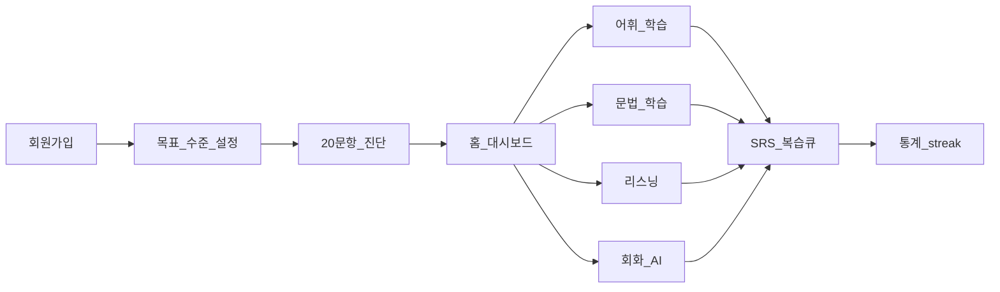

# Ted Voca — 마스터 작업계획서

> 앱 표시명: **Ted Voca** (한글: 테드 보카)

## 0. 프로젝트 개요

| 항목 | 내용 |
|------|------|
| 앱 이름 | **Ted Voca** |
| 브랜드 | Ted — 사용자 영어 이름을 마스코트/가이드 캐릭터로 활용 |
| 한 줄 정의 | 단어·문법·리스닝·회화를 게임처럼 배우는 모바일 영어 학습 앱 |
| 1차 플랫폼 | **React Native + Expo** (iOS / Android) |
| MVP 범위 | 말해보카와 동급 **풀스위트** (단, 출시는 단계적 릴리스) |
| 레퍼런스 | [말해보카](https://epop.ai/ko) — 어휘 퀴즈, 실력 진단, SRS 복습, 문법 카드, 리스닝, AI 회화, 리그/통계 |
| 저장소 | `/Users/heowooyong/cursor/learning/ted_voca` |

### 0.1 말해보카 대비 차별화 (Ted Voca만의 정체성)

말해보카를 **기능 벤치마크**로 삼되, 아래 3가지로 차별화합니다.

1. **Ted 페르소나** — 온보딩·피드백·격려 멘트를 "Ted가 코치" 컨셉으로 통일 (친근한 1:1 튜터 느낌)
2. **투명한 학습 데이터** — 복습 스케줄(SRS), 정답률, 약점 단어를 사용자가 직접 확인·조정 가능
3. **오픈 아키텍처** — 코스/단어팩을 JSON/DB 시드로 추가 가능 (초기엔 자체 콘텐츠, 이후 커스텀 코스 확장)

---

## 1. 목표 및 성공 기준

### 1.1 제품 목표 (DoD — v1.0 풀스위트)

- [x] 신규 사용자가 **5분 온보딩 + 20문항 레벨 테스트** 후 맞춤 코스 시작 (P0/P1)
- [x] **어휘**: 빈칸/4지선다/철자 퀴즈 + 코스별 단어팩(토익·일상·수능 등) (P1)
- [x] **SRS 복습**: SM-2 기반 자동 복습 큐 + "오늘의 복습" 알림 (P2 + P6 로컬 알림)
- [x] **문법**: 카드 배열/선택형 문법 퀴즈 + 오답 해설 (P3)
- [x] **리스닝**: 원어민 TTS 재생 → 따라 말하기(선택) → comprehension 퀴즈 (P4, 실기기 오디오 검증 잔여)
- [x] **회화/스피킹**: 상황별 대화 시나리오 + STT 입력 + LLM 피드백 (P5, Edge 실배포·실기기 검증 잔여)
- [x] **게임화**: 일일 목표, streak, 간단 리그(주간 XP), 학습 통계 대시보드 (P6)
- [x] **오프라인**: 최근 학습 세션·단어팩 캐시 (지하철 등 네트워크 불안정 환경) (P6, 네이티브 전용·실기기 sync 검증 잔여)

### 1.2 비목표 (v1.0에서 제외)

- App Store / Play Store 유료 구독 결제 (v1.1 이후)
- 캐릭터 꾸미기 상점 (v1.1)
- 소셜 친구 대결 / 채팅
- 웹 버전 (모바일 우선, Expo Web은 개발용만)

---

## 2. 핵심 사용자 여정



**일일 루프 (DAU 핵심)**

1. 푸시: "Ted: 오늘 복습 12개 남았어!"
2. 복습 5분 → 신규 학습 10분 → streak + XP
3. 주간 리그 순위 확인

---

## 3. 기능 명세 (모듈별)

### 3.1 공통

| 기능 | 설명 |
|------|------|
| 인증 | 이메일/소셜(Google, Apple) — Supabase Auth |
| 프로필 | 목표(시험/회화/비즈), 일일 목표(분/문항), 현재 레벨(CEFR 추정) |
| 레벨 테스트 | 20문항 adaptive quiz → `user_level`, `weak_tags` 산출 |
| 홈 | 오늘 할 일(복습/신규), streak, XP, 코스 진행률 |
| 통계 | 학습 시간, 정답률, mastered/wrong 단어, 주간 차트 |

### 3.2 어휘 (Vocabulary)

- **퀴즈 유형**: 빈칸 채우기, 4지선다 뜻, 영→한 / 한→영, 철자 입력
- **난이도 조절**: 최근 10문항 정답률 기반 easy/normal/hard
- **코스**: 토익 800, 수능 필수, 일상 회화, 비즈니스 (각 500~2000 단어)
- **단어 카드**: 발음(TTS), 예문, 동의어, 태그(part-of-speech, topic)

### 3.3 SRS 복습 (Spaced Repetition)

- **알고리즘**: SM-2 (Anki 호환 필드: ease, interval, repetitions)
- **복습 트리거**: `next_review_at <= now()` 인 카드
- **Memory Booster**: 최근 7일 학습 문장 TTS 자동 재생 모드

### 3.4 문법 (Grammar)

- **퀴즈**: 카드 드래그 정렬로 문장 완성, 빈칸 선택, 오류 찾기
- **문법 사전**: A1~C1 토픽별 설명 + 예문 (초기 50~80 토픽)
- **오답 해설**: 왜 틀렸는지 2~3문장 + 관련 규칙 링크

### 3.5 리스닝 (Listening)

- **흐름**: 짧은 오디오(5~15초) 재생 → (선택) 따라 말하기 → comprehension 1~2문항
- **속도**: 0.75x / 1.0x / 1.25x
- **콘텐츠**: 코스별 예문 + TED Talk 스타일 짧은 monologue (자체 작성)

### 3.6 회화 / 스피킹 (Speaking + AI)

- **시나리오**: 카페 주문, 호텔 체크인, 미팅 등 20~30 시나리오
- **STT**: OpenAI Whisper API 또는 on-device STT
- **LLM 피드백**: 문법·자연스러움·대안 표현 3줄 (GPT-4o-mini 등)
- **안전장치**: API 비용 cap, 일일 회화 횟수 제한(무료 10회)

### 3.7 게임화

- **XP / 레벨**: 모듈별 XP, 사용자 레벨(Lv.1~100)
- **Streak**: 연속 학습일 (하루 1세션 이상)
- **리그**: 주간 XP 기준 브론즈/실버/골드 티어

---

## 4. 기술 아키텍처

### 4.1 권장 기술 스택

| 레이어 | 선택 |
|--------|------|
| 모바일 | Expo SDK 52+, Expo Router, TypeScript |
| UI | NativeWind + React Native Reanimated |
| 로컬 DB | expo-sqlite (P2+) |
| 상태 | Zustand + TanStack Query |
| 백엔드 | Supabase (Auth + Postgres + RLS) |
| AI | OpenAI Whisper + GPT-4o-mini |
| 오디오 | expo-av, expo-speech |
| 푸시 | expo-notifications |
| CI | EAS Build + GitHub Actions |

### 4.2 디렉터리 구조

```
ted_voca/
├── apps/mobile/          # Expo 앱
├── packages/shared/      # types, quiz logic, SM-2
├── supabase/             # migrations, seed
├── content/              # word packs JSON
└── docs/
    ├── plans/
    └── ADR/
```

---

## 5. 데이터 모델 (핵심 엔티티)

- `profiles`, `courses`, `words`, `grammar_topics`, `grammar_questions`
- `listening_clips`, `speaking_scenarios`, `dialogue_turns`
- `user_words` (SRS state), `study_sessions`, `quiz_attempts`
- `league_entries` (weekly XP)

상세 스키마: [`supabase/migrations/001_initial_schema.sql`](../supabase/migrations/001_initial_schema.sql)

---

## 6. 콘텐츠 전략

| 소스 | 용도 | 주의 |
|------|------|------|
| 자체 작성 예문 | 퀴즈·리스닝·회화 | 1차 MVP 주력 |
| 공개 word frequency list | 단어 선정 우선순위 | COCA/NGSL 등 |
| AI 생성 | 보조 예문·해설 | human review 필수 |
| 상용 교재 OCR | **사용 금지** | 저작권 리스크 |

**초기 콘텐츠 목표 (v1.0)**

- 단어 3,000개 (토익 1,500 + 일상 1,000 + 비즈 500)
- 문법 토픽 60개, 문항 600+
- 리스닝 클립 200+
- 회화 시나리오 25개

---

## 7. 단계별 로드맵 (Phase)

| Phase | 기간(추정) | 산출물 | plan doc (ted-run 실행 단위) |
|-------|-----------|--------|------------------------------|
| **P0 Foundation** | 2주 | Expo, Auth, 온보딩, 홈 shell | [p0-foundation.md](plans/p0-foundation.md) ✅ 완료 |
| **P1 Vocab Core** | 3주 | 레벨 테스트, 어휘 퀴즈, 토익 코스 | [p1-p2-vocab-srs.md](plans/p1-p2-vocab-srs.md) ✅ 완료 (P1+P2 통합) |
| **P2 SRS + Stats** | 2주 | SM-2, 복습, streak/XP/통계 | ↑ ✅ 완료 |
| **P3 Grammar** | 3주 | 문법 퀴즈 + 사전 60토픽 | [p3-grammar.md](plans/p3-grammar.md) ✅ 완료 (1차 20토픽/200문항) |
| **P4 Listening** | 2주 | 오디오, comprehension, Memory Booster | [p4-listening.md](plans/p4-listening.md) ✅ 완료 (TTS 기반, 클립 30/문항 50 — 실기기 오디오 검증만 잔여) |
| **P5 Speaking + AI** | 3주 | STT, LLM 피드백, 시나리오 25 | [p5-speaking-ai.md](plans/p5-speaking-ai.md) ✅ 완료 (Edge Function·시나리오 10/턴 68 — Edge 실배포·실기기 검증만 잔여) |
| **P6 Gamification** | 2주 | 리그, 푸시, 스토어 준비 | [p6-gamification.md](plans/p6-gamification.md) ✅ 완료 (주간 리그·로컬 알림 3종·오프라인 sync·push 수집 — 실서버 마이그레이션·EAS 실빌드·스토어 제출만 잔여) |

**총 추정: 17주 (~4개월), 1인 풀타임 기준 — ted-run 실행은 4회 (P1+P2 / P3·P4 / P5 / P6)**

### v1.1 후속 (코드 완결 후)

| 항목 | 산출물 | 상태 |
|------|--------|------|
| 리그 group_no 분할 | tier 내 30명 단위 그룹 — migration 008, shared `assignGroupNos`/`pickGroupNoForNewEntry`, 보드 그룹 격리 ([ADR-0008](ADR/ADR-0008-league-group-split.md)) | ✅ 코드 완결 (실서버 008 적용·30명+ 검증 잔여) |
| 원격 푸시 발송 | push_tokens 기반 서버 발송 파이프라인 (현재 토큰 수집만) | ⬜ 후순위 |
| 유료 구독 결제(IAP) | App Store / Play Store 결제, 상점 | ⬜ 후순위 |

---

## 8. 관련 문서

- 작업계획서: [P0](plans/p0-foundation.md) · [P1+P2](plans/p1-p2-vocab-srs.md) · [P3](plans/p3-grammar.md) · [P4](plans/p4-listening.md) · [P5](plans/p5-speaking-ai.md) · [P6](plans/p6-gamification.md)
- [와이어프레임](design/wireframes.md)
- [인터랙티브 프로토타입](prototype/index.html) — P0~P6 전체 동선 클릭 모형
- [토익 단어팩 시드](../content/toeic-800-pack.json)
